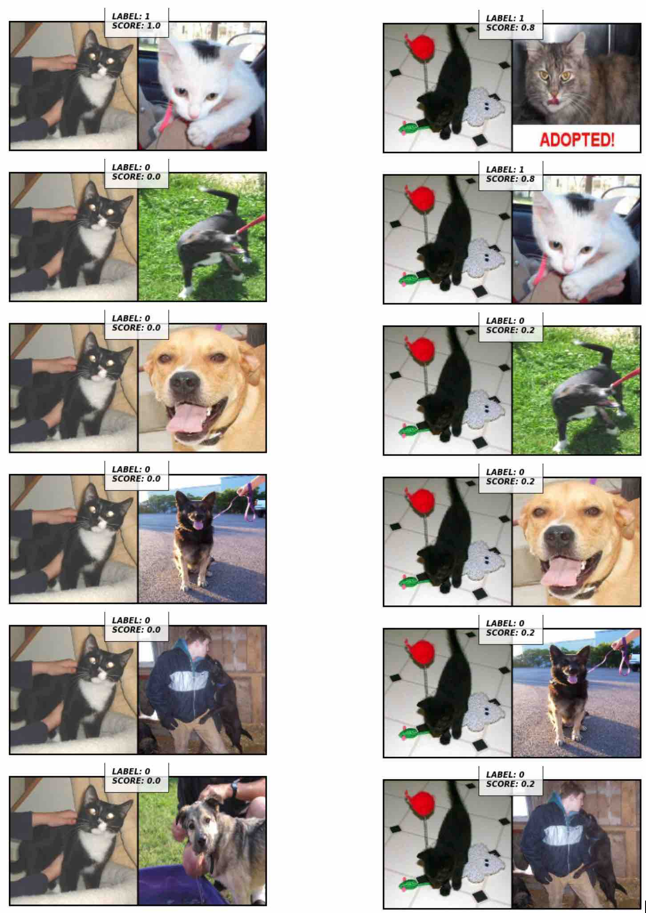

# Siamese Network using Triplets in PyTorch

This notebook show how to build and train a Siamese Network to check similarities between image classes. This is based on a real project I did where I have only 50 pictures of 2 different classes.

With so little pictures it is hard to build a classifier that is robust. So, the trick is to use a Siamese Network not to classify the pictures in one or another class, but to check how similar two pictures are. If they are from same class, we expect high similarity otherwise low similarity. To perform this I used the triplet loss, which is composed by three images:

- Anchor image
- Positive image, with the same class as the Anchor (but not the same image)
- Negative image, with a different class from the previous two. This way the aim of the network is to project embeedings, and when the images are from the same class, the embeedings must be nearby each other, and when the images are from different class the embeedings are projected far from each other. How far/near the embeedings are projected is defined by the margin hyperparameter.

To show this in practice, we'll use a real dataset of cats and dogs. What I mean by real dataset is a dataset that is not already preprocessed and "easy" available in the PyTorch or TensorFlow libraries. When we deal with real projects, what we have are pictures in folders that must be prepared and organized in the right way to be processed. So, let's use this approach to build a custom dataloader, perform some augmentations and feed to network.

## Results

